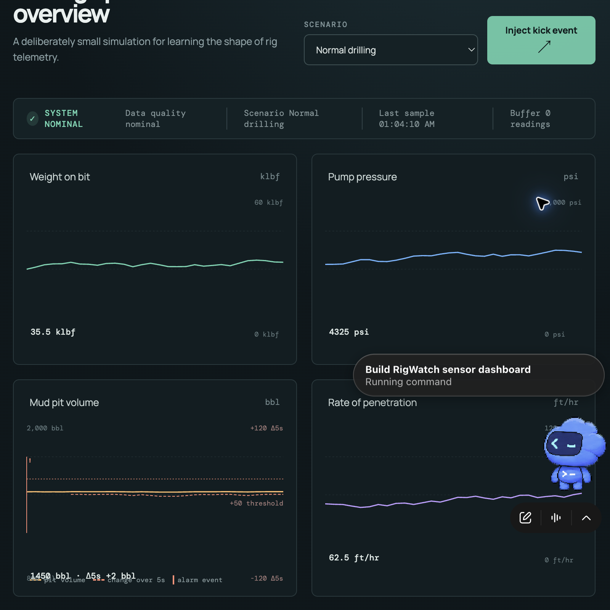

# RigWatch
RigWatch is a small simulated project built to understand the shape of drilling telemetry and the domain language around it. It does **not** use real Pason data, products, or integrations. Codex helped scaffold the project; the code is intentionally compact enough to read through 

## Live demo

[Open the live RigWatch demo](https://alexander124-jpg.github.io/RigWatch/)

The site is configured to deploy from `main` with GitHub Actions and GitHub Pages. To publish it the first time, enable `Settings → Pages → Source: GitHub Actions` in the repository; later pushes deploy automatically. The dashboard below shows the pit-volume chart with its alarm marker, threshold, and five-second change line.



## Run it

```bash
npm install
npm run dev
```

Checks:

```bash
npm run lint   # ESLint plus TypeScript type-check
npm test       # Vitest unit tests
npm run build  # production build
```

## Architecture

- `src/simulator.ts` owns the one-reading-per-second random walk and five short demo scenarios: normal, kick, lost circulation, pressure loss, and sensor dropout.
- `src/App.tsx` owns the small amount of UI state. It keeps the most recent 60 readings, renders four SVG line charts, and coordinates the alarm lifecycle.
- `src/alarm.ts` contains pure, typed functions. It calculates the five-second pit change, detects a strict threshold crossing, applies the cooldown, and transitions alarm status without knowing about React or the DOM.
- `src/quality.ts` checks finite values and deliberately broad operating ranges. In a real system these limits would come from sensor metadata and well context.
- `src/buffer.ts` is a FIFO queue. While offline, generated readings go into the queue. On reconnect, `flush()` returns a copy in insertion order and clears the queue.

## Alarm logic

The demo uses `increaseThreshold: 50` bbl, `windowSeconds: 5`, and a 15-second cooldown. The detector takes the newest reading, finds the oldest reading at least five seconds earlier, and calculates:

```text
newest.mudPitVolume - oldest.mudPitVolume > 50
```

The comparison is intentionally strict: exactly +50 bbl is the borderline no-alarm case, while exactly five seconds is eligible. A new alarm is created only when the detector changes from false to true and the cooldown has elapsed. It starts active, can be acknowledged, and becomes cleared when the detector condition ends. The pit chart marks alarm events and plots both absolute pit volume and the five-second change.

The scenario menu makes a short interview demo easy: a kick raises pit volume, lost circulation drops it, pressure loss reduces pump pressure, and sensor dropout emits a missing pit-volume value that the data-quality check flags.

## What I would improve

For a production-like version I would use a real event/time source, persisted offline storage, sequence numbers and acknowledgements for reconnects, deduplication, server-side alarm evaluation, richer sensor quality metadata, and an accessible charting layer with annotations. I would also separate display history from the data-delivery queue so replaying offline data could not be confused with current time.

## Deliberate break-and-repair check

I verified the tests by temporarily changing the detector's `>` comparison to `>=`; the borderline test failed as expected. I restored the strict comparison and reran the suite successfully. This is a simulated learning project, not a claim of operational rig monitoring.
